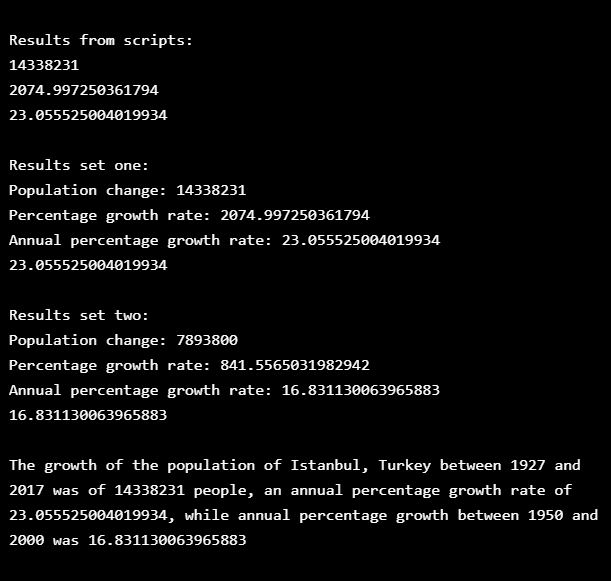

# calculating_population_change_Py_3
Use Python to calculate the population growth of Istanbul and print out a short report. Codecademy practice exercise.

The description of the excercise is: _You work at the UN in urban planning and are interested in tracking population growth across major metropolitan regions. You are hoping that by looking at historical population numbers that you can predict future growth and help your team make decisions about resourcing_.

## General info
The purpose of the project is just personal learning. I may revisit this code to find different solutions or to apply it under other context. 

## Description
First there are some scripts that calculate some of the variables (The stuff under _"Print initial scripts division"_) . Then these calculations are included into function _population_growth_ which prints the calculations from scripts and return the growth percentage. Then some of the data is added to a string _report_ to make it more readable. 

#### To-do list:
* The report is not getting the years from variables. Probably I need to add the years as part of pop_2017 so that year and population are set together in a list or dictionary.
* I would like to return more variables on the function. Right now it only prints different calculations and return just the annual growth. 

## Table of contents
* [General info](#general-info)
* [Description](#description)
* [Screenshots](#screenshots)
* [Technologies](#technologies)
* [Setup](#setup)
* [Status](#status)
* [References](#references)

## Screenshots

## Technologies
* Python 3

## Setup
NA - It's only coding examples, there's no setup.

## Status
Project is: technically _finished_, but I want to do some improve it - may come back and improve it, or not.

## References
Based on Codecademy's _Visualize Data with Python_ course excercise
